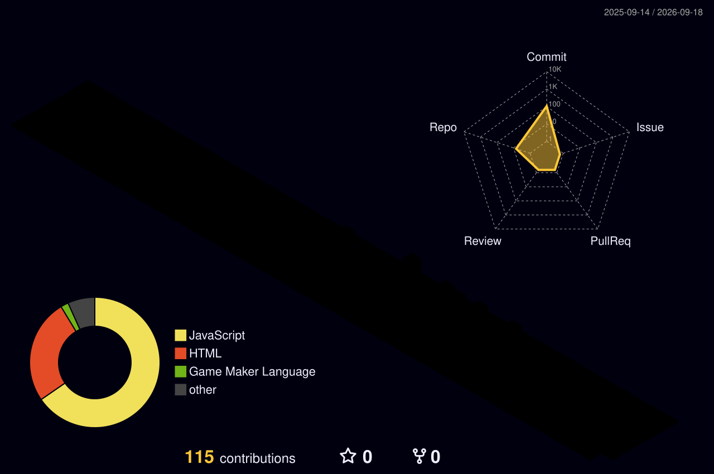

<!-- HERO BANNER AZUL-CLARO / VERDE-CLARO -->

<!-- ANIMATED TYPING TEXT -->

  
  
  
  

---

### 👨‍💻 Sobre Mim

> 💡 *"Transformando problemas complexos em código limpo, eficiente e de alto impacto."*

<table border="0">
  <tr>
    <td width="50%" valign="top">
      <h4>🎓 Formação & Localização</h4>
      <ul>
        <li>📚 Cursando <b>Engenharia de Software (4º período)</b> na <b>PUCPR</b>.</li>
        <li>📍 <b>Curitiba, PR - Brasil</b> 🇧🇷.</li>
        <li>🌱 Aprendizado focado em arquitetura e boas práticas de desenvolvimento.</li>
      </ul>
    </td>
    <td width="50%" valign="top">
      <h4>🎯 Foco & Objetivos</h4>
      <ul>
        <li>🚀 Construção de <b>Aplicações Web & APIs RESTful</b></li>
        <li>⚙️ Aplicação de <b>Clean Code</b>, princípios <b>MVP</b> e boas práticas.</li>
        <li>🤝 Aberto a projetos, desafios e oportunidades de desenvolvimento.</li>
      </ul>
    </td>
  </tr>
</table>

---

### 🛠️ Tech Stack & Habilidades

  

---

### 🖥️ Digital Workstation

  
  
  

---

### 📊 Estatísticas & Atividade

  <table border="0">
    <tr>
      <td>
        
      </td>
      <td>
        
      </td>
    </tr>
  </table>

  
  
    

  

---

### 🧊 Gráfico de Contribuições 3D

  <picture>
    <source media="(prefers-color-scheme: dark)" srcset="./profile-3d-contrib/profile-night-rainbow.svg">
    <source media="(prefers-color-scheme: light)" srcset="./profile-3d-contrib/profile-green-animate.svg">
    
  </picture>

---

### 🐍 Snake Game das Contribuições

  <picture>
    <source media="(prefers-color-scheme: dark)" srcset="https://raw.githubusercontent.com/MarcoBruschi/MarcoBruschi/output/github-contribution-grid-snake-dark.svg">
    <source media="(prefers-color-scheme: light)" srcset="https://raw.githubusercontent.com/MarcoBruschi/MarcoBruschi/output/github-contribution-grid-snake.svg">
    
  </picture>

---

<!-- FOOTER -->

  

